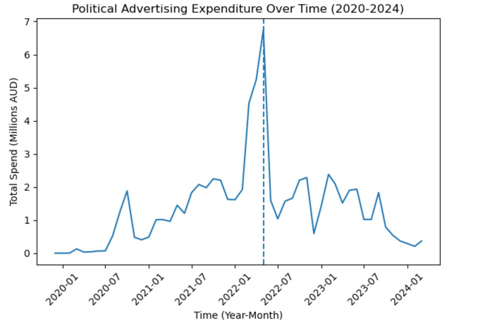
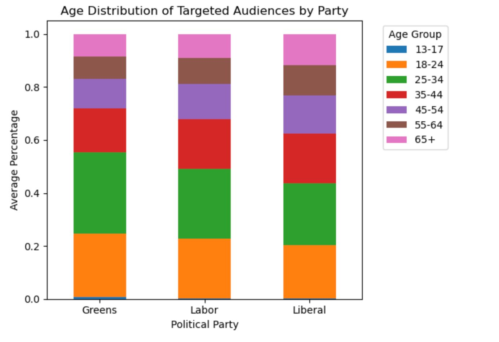
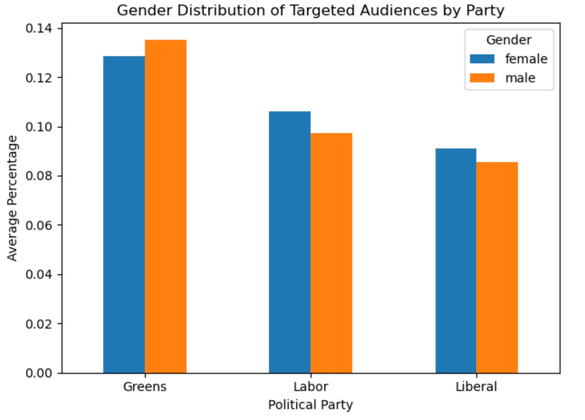
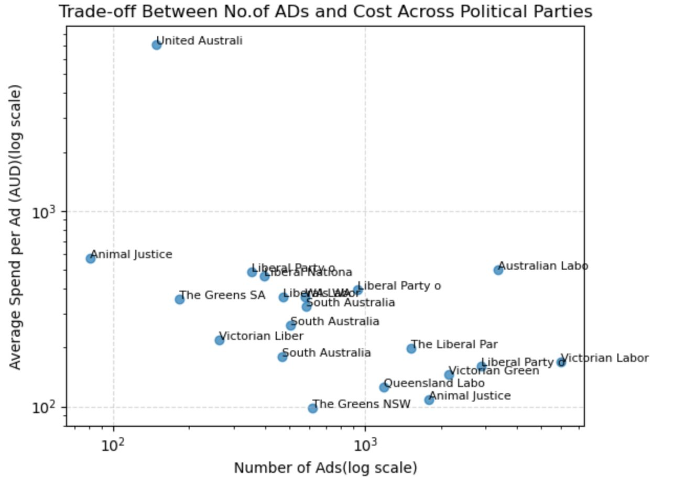

# NSW Electoral Expenditure Analytics

## Overview

This capstone project analyses electoral expenditure disclosures published by the NSW Electoral Commission to investigate campaign spending patterns, funding distribution, and expenditure trends across political parties.

The project aims to improve the transparency and interpretability of electoral expenditure data by transforming complex transaction-level disclosures into meaningful insights through data analysis and interactive visualisation.

## Research Objectives

- Analyse electoral expenditure trends across political parties
- Compare spending patterns and allocation strategies
- Examine expenditure distribution across categories
- Identify anomalies and the impact of high-value transactions
- Develop an interactive Power BI dashboard for stakeholder exploration
- Explore opportunities for predictive modelling of expenditure trends

## Technologies Used

### Programming & Analysis
- Python
- Pandas
- NumPy
- Jupyter Notebook

### Visualisation
- Matplotlib
- Seaborn
- Power BI

### Analytical Methods
- Data Cleaning & Preprocessing
- Exploratory Data Analysis (EDA)
- Time-Series Analysis
- Comparative Party Analysis
- Spending Category Analysis

## Methodology

1. Extract electoral expenditure disclosures from NSW Electoral Commission data.
2. Clean and preprocess transaction-level records.
3. Standardise dates and expenditure values.
4. Aggregate expenditure across parties, categories, and time periods.
5. Perform exploratory data analysis to identify trends and patterns.
6. Develop visualisations and an interactive dashboard.
7. Investigate predictive modelling approaches for forecasting expenditure trends.

## Dataset Overview

The analysis uses a cleaned expenditure dataset constructed from publicly available NSW Electoral Commission disclosure records.

The dataset includes expenditure transactions from major political parties and contains the following attributes:

| Variable | Description |
|-----------|-------------|
| Party | Political party responsible for expenditure |
| Date | Transaction date |
| Supplier | Organisation receiving payment |
| Description | Expenditure description |
| Amount | Transaction value (AUD) |
| Category | Categorised expenditure type |

The cleaned dataset was created by extracting, standardising, and merging disclosure records from multiple source documents.

## Repository Contents

- `data/` – cleaned expenditure dataset used for analysis
- `notebooks/` – Python notebook containing data cleaning and exploratory analysis
- `reports/` – project proposal and supporting documentation
- `visualisations/` – charts generated during analysis

## Data Source

The analysis is based on publicly available electoral expenditure disclosures obtained from the NSW Electoral Commission.

Raw disclosure records were extracted from party expenditure reports and transformed into a structured analytical dataset suitable for statistical analysis and visualisation.

## Key Findings

- Liberal Party recorded the highest expenditure among the parties analysed.
- Electoral expenditure exhibited substantial variation across political parties and expenditure categories.
- Spending patterns intensified during election-related periods.
- A small number of high-value transactions contributed significantly to overall expenditure totals.
- Demographic targeting patterns differed across parties when analysing age and gender distributions.

## Sample Visualisations

### Electoral Spending Over Time

### Age Distribution of Targeted Audiences

### Gender Distribution of Targeted Audiences

### Trade-off Between Number of Advertisements and Cost

## Skills Demonstrated

- Data Cleaning and Preprocessing
- Exploratory Data Analysis (EDA)
- Data Visualisation
- Statistical Analysis
- Time-Series Analysis
- Comparative Analysis
- Python Programming
- Stakeholder-Oriented Reporting
- Power BI Dashboard Development

## Project Status

In Progress

Current focus areas:
- Dashboard development in Power BI
- Category-level expenditure analysis
- Predictive modelling of expenditure trends

## Author

Akhileshwar Reddy Kolanupaka

Master of Data Science  
The University of Queensland

